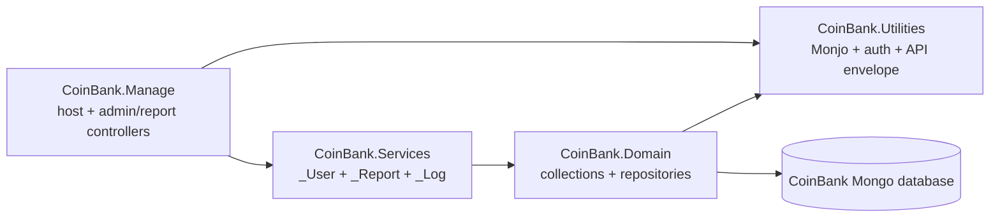

# Architecture

CoinBank Manage is a four-project N-tier backend:

`coinbank.manage` uses the same Mongo database as `coinbank.manage`, but has its own host and runtime.
It does not start public API blockchain workers, SignalR hubs, or TRON sidecars.

## Host Pipeline

`CoinBank.Manage/Program.cs` wires:

1. Controllers, API versioning, Swagger.
2. Shared settings and Autofac marker-interface DI.
3. Request logging and exception handling.
4. JWT blacklist, CORS, firewall, signature, JWT, rate limit, authorization.
5. Controller endpoints.

## Admin Auth

Admin login uses username/password and the existing `Users` collection with `Role.Admin`. The
configured admin is seeded on matching login if missing. This follows `slt.manage` instead of
adding a separate admin-only persistence model.

## Reports

Report controllers are admin-gated and delegate to `_Report` services. Export renderers live under
`CoinBank.Services/_Report/Exports` and share the same query DTOs as JSON report endpoints.
