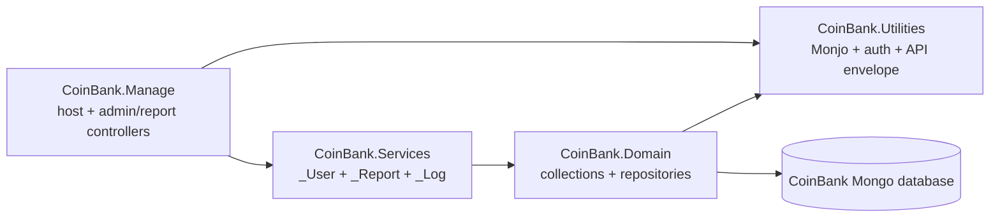

# Review Guide

<!-- rz-review:generated:start -->
## Project Facts

- Project: coinbank.manage
- Project kinds: Backend service
- Package manager: not detected

## Baseline Review Rules

### R1. Review behavior

Report only concrete issues that can affect correctness, security, maintainability, performance, accessibility, or user experience. Do not comment on style preferences unless this guide or the changed project conventions require it.

### R2. Severity

- blocker: must fix before merge because it can break production, expose data, corrupt state, or block core workflows.
- major: should fix before merge because it creates a real defect, regression risk, or hard-to-maintain design.
- minor: useful improvement with limited risk.
- nit: small cleanup; avoid posting unless it is clearly tied to project conventions.

### R3. Evidence

Every Review Finding must cite the changed code and explain the failure mode. Prefer one precise comment over several broad comments.

### R4. Project conventions

When this guide conflicts with discovered project conventions, prefer the explicit human-written sections in this file and the docs referenced by REVIEW_INDEX.md.

### R5. Generated and vendored code

Do not review generated, vendored, lockfile, build output, coverage output, or binary files unless the change directly modifies build/runtime behavior.

### R6. Security boundaries

Flag exposed secrets, unsafe shell execution, SQL/string injection, missing auth checks, unsafe webhook validation, and unvalidated external input at service boundaries.

### R7. Frontend quality

For frontend changes, check responsive behavior, accessibility basics, loading/error states, state consistency, and whether UI text or controls can overflow on narrow screens.

### R8. Backend quality

For backend changes, check input validation, error handling, idempotency, observability, transaction boundaries, API contract stability, and data consistency.

## Imported Project Instructions

These excerpts are imported from target-project-owned instruction docs during setup/refresh. Treat explicit rules, "do not" statements, build commands, scope boundaries, security rules, and load-bearing conventions in these sources as project-specific review requirements.

Sources:

- `AGENTS.md`
- `CLAUDE.md`
- `CONTEXT.md`
- `CODEBASE_MAP.md`
- `README.md`
- `docs/ARCHITECTURE.md`
- `docs/SECURITY.md`
- `docs/WORKFLOW.md`
- `docs/CI.md`

### AGENTS.md

# AGENTS.md - CoinBank Manage

`CLAUDE.md` is the source of truth. This file mirrors the load-bearing rules for Codex, Cursor,
Gemini, and other non-Claude agents.

CoinBank Manage is a .NET 8 N-tier admin/report API on the same Mongo database as
`coinbank.api`. It follows the `slt.manage` sibling-project pattern, not a microservice, Clean
Architecture, DDD, CQRS, EF, or a frontend.

Dependency chain:

```text
CoinBank.Manage -> CoinBank.Services -> CoinBank.Domain -> CoinBank.Utilities
```

Rules:

1. **"Monjo" is intentional**: `MonjoRepository`, `IMonjoConnection`, `MonjoQuery`,
   `MonjoCollectionName`, `MonjoSettings`.
2. **`<Nullable>disable</Nullable>`** everywhere. No NRT annotations or `required`.
3. **Reads are POST** with body DTOs.
4. **Soft-delete is automatic** in `MonjoRepository`; do not re-filter `IsDeleted`.
5. **`[Authorize]` is `Utilities.Filters.AuthorizeAttribute`**, not ASP.NET Core's attribute.
6. **DI is Autofac by marker interface**; no manual business-service registration.
7. **Settings inject as plain classes** registered by the shared settings composition.
8. **No tests/formatter/CI enforcement**; build is the validation gate.

Build:

```bash
dotnet build CoinBank.Manage.slnx
```

AI setup:

- `.mcp.json` carries local Claude project MCP servers.
- `.codex/config.toml` carries Codex MCP servers, including Linear and Notion through
  `mcp-remote`.
- Claude Code local MCP entries for `linear-server` and `notion` are registered for this project.

PM surfaces freeze during implementation. Do not update Linear or Notion until the human asks
after review/commit.

### CLAUDE.md

# CLAUDE.md - CoinBank Manage

Source of truth for agents in this repo.

CoinBank Manage is the back-office sibling of `coinbank.api`. It is a .NET 8 N-tier Web API on the
same CoinBank Mongo database, patterned after `cargo/slt.manage`.

```text
CoinBank.Manage -> CoinBank.Services -> CoinBank.Domain -> CoinBank.Utilities
```

## Scope

In scope:
- Admin username/password login and seeding via the existing `Users` collection with `Role.Admin`.
- Admin-gated report endpoints.
- Excel/CSV/PDF report exports.
- Shared CoinBank collections/repositories needed to read the public API database.

Out of scope:
- Public wallet-signature auth endpoints.
- On-chain RPC/WebSocket clients.
- TRON sidecars.
- SignalR hubs.
- Hosted blockchain/price/presale schedulers.

## Load-bearing conventions

1. **"Monjo" is intentional**. Never rename it to Mongo.
2. **Nullable is disabled**. No `?` NRT annotations or `required`.
3. **Reads are POST** with body DTOs.
4. **Soft-delete is automatic** in `MonjoRepository`.
5. **`[Authorize]` is the custom `Utilities.Filters.AuthorizeAttribute`**.
6. **DI uses Autofac marker interfaces**. Do not manually register business services.
7. **Settings inject as plain classes**, not `IOptions<T>`.
8. **No formatter/tests/CI gate**. Build before considering work done.

## Build

```bash
dotnet build CoinBank.Manage.slnx
dotnet build CoinBank.Manage/CoinBank.Manage.csproj -c Release
```

## MCP

`linear-server` and `notion` are configured for Codex and Claude Code. Do not write to PM surfaces
while implementing; sync them only when the human explicitly asks.

### CONTEXT.md

# CoinBank Manage

Back-office admin/report API for CoinBank. It reads the same Mongo database as `coinbank.api` but
runs as a separate four-layer sibling patterned after `slt.manage`.

## Domain

**Admin / Reporter**:
A `User` row with `Role=Admin` who authenticates by username/password and receives report
permissions in JWT claims.
_Avoid_: treating admins as wallet-auth customers; adding a separate admin database when the
shared `Users` collection is the reference pattern.

**ReportView permission**:
Single coarse permission code used to gate every admin report and export endpoint.
_Avoid_: per-section permissions unless the product explicitly asks.

**Admin report**:
Read-only operational/accounting view over existing CoinBank business collections, returned as JSON
and exportable as Excel/CSV/PDF.

**Notional value (USD)**:
Common-unit measure derived from price stored on each business record at the time it occurred, not a
live re-price.

**Treasury Program**:
Admin-reporting name for staking obligations: locked principal, committed/paid reward, reward rate,
and maturity. Same `Stake` and `Withdrawal` collections; not a separate product.

**Treasury custody**:
Accounting view of platform holdings/flows. Amounts come from typed business collections; never from
live wallet-balance snapshots.

## Platform

**Monjo**:
Hand-rolled MongoDB abstraction (`MonjoRepository<T>`, `IMonjoConnection`, `MonjoQuery`,
`[MonjoCollectionName]`). Intentional spelling.

**Soft-delete**:
Deletes set `IsDeleted=true`; reads auto-filter `!IsDeleted`. `RealDeleteManyAsync` is the only hard
delete.

**ApiResult**:
Universal response envelope applied by `[ApiResultFilter]`.

**JWE**:
Encrypted JWT used by the shared auth utilities.

**Signature middleware**:
Request gate requiring `ApplicationId`, `Nonce`, and `Signature` headers.

**RegisterMode marker**:
DI opt-in: `IScopedDependency`, `ITransientDependency`, `ISingletonDependency`,
`ISelfSingletonDependency`, `IHostedDependency`.

This manage runtime intentionally has no public wallet-signature auth flow, on-chain RPC clients,
SignalR hubs, or TRON sidecar.

### CODEBASE_MAP.md

# Codebase Map

Dependency chain:

```text
CoinBank.Manage -> CoinBank.Services -> CoinBank.Domain -> CoinBank.Utilities
```

| Layer | Path | Contents |
| --- | --- | --- |
| Host | `CoinBank.Manage/` | `Program.cs`, `Controllers/V1/`, host middleware/config, appsettings |
| Services | `CoinBank.Services/` | `_User`, `_Report`, `_Log` |
| Domain | `CoinBank.Domain/` | Shared CoinBank Mongo collections and Monjo repositories |
| Utilities | `CoinBank.Utilities/` | API envelope, exceptions, auth, JWT, permissions, Monjo, DI, settings |

## Admin Auth

- Controller: `CoinBank.Manage/Controllers/V1/AuthController.cs`
- Service: `CoinBank.Services/_User/UserService.cs`
- DTO: `CoinBank.Services/_User/DTOs/Updates/AdminLoginUpdate.cs`
- Admin user: existing `Users` collection, `Role.Admin`, seeded from `JwtServiceSettings`.

## Reports

- Controllers: `DashboardController`, `SwapReportController`, `TreasuryController`,
  `TokenReleaseController`, `PreSaleReportController`, `UserReportController`,
  `FinancialController`.
- Services and DTOs: `CoinBank.Services/_Report/`.
- Exports: `CoinBank.Services/_Report/Exports/`.

## Add/change

| Task | Edit |
| --- | --- |
| New report endpoint | Add controller action in `CoinBank.Manage/Controllers/V1/`, DTO/service logic in `_Report` |
| New admin auth behavior | Change `_User/UserService.cs` and `AuthController.cs` |
| Repository/index change | Change `CoinBank.Domain/Repositories/*Repository.cs` |
| Permission change | Change `CoinBank.Utilities/Permissions/Permissions.cs` |
| Host pipeline change | Change `CoinBank.Manage/Program.cs` or `CoinBank.Manage/Utilities/Middlewares/` |

There is no on-chain runtime, SignalR runtime, or TRON sidecar in this manage sibling.

### README.md

# CoinBank Manage

Back-office .NET 8 API for CoinBank admin authentication, dashboard/report queries, and report
exports. This is a separate sibling of `coinbank.api`, patterned after `slt.manage`, and uses the
same CoinBank Mongo database.

Layering:

```text
CoinBank.Manage -> CoinBank.Services -> CoinBank.Domain -> CoinBank.Utilities
```

Projects:

| Project | Role |
| --- | --- |
| `CoinBank.Manage` | ASP.NET Core host, V1 admin/report controllers, middleware pipeline |
| `CoinBank.Services` | `_User` admin login/seed, `_Report` report/export services, `_Log` |
| `CoinBank.Domain` | Shared CoinBank Mongo collections and Monjo repositories |
| `CoinBank.Utilities` | Cross-cutting API result, auth, JWT, Monjo, DI, settings, permissions |

Build:

```bash
dotnet build CoinBank.Manage.slnx
dotnet build CoinBank.Manage/CoinBank.Manage.csproj -c Release
```

Run locally:

```bash
dotnet run --project CoinBank.Manage
```

Deploy shape:

```bash
dotnet publish CoinBank.Manage/CoinBank.Manage.csproj -c Release -o publish
docker build -t coinbank.manage .
docker-compose up -d
```

This project intentionally excludes public wallet-auth endpoints, on-chain clients, TRON sidecars,
SignalR hubs, and blockchain background schedulers.

### docs/ARCHITECTURE.md

# Architecture

CoinBank Manage is a four-project N-tier backend:



`coinbank.manage` uses the same Mongo database as `coinbank.manage`, but has its own host and runtime.
It does not start public API blockchain workers, SignalR hubs, or TRON sidecars.

## Host Pipeline

`CoinBank.Manage/Program.cs` wires:

1. Controllers, API versioning, Swagger.
2. Shared settings and Autofac marker-interface DI.
3. Request logging and exception handling.
4. JWT blacklist, CORS, firewall, signature, JWT, rate limit, authorization.
5. Controller endpoints.

## Admin Auth

Admin login uses username/password and the existing `Users` collection with `Role.Admin`. The
configured admin is seeded on matching login if missing. This follows `slt.manage` instead of
adding a separate admin-only persistence model.

## Reports

Report controllers are admin-gated and delegate to `_Report` services. Export renderers live under
`CoinBank.Services/_Report/Exports` and share the same query DTOs as JSON report endpoints.

### docs/SECURITY.md

# Security

CoinBank Manage is an admin surface. Treat every endpoint as privileged.

Rules:

- Admin report endpoints require the custom `Utilities.Filters.AuthorizeAttribute` with
  `RequireActiveUser = true`, `RequireAdmin = true`, and `Permissions.ReportView`.
- Admin credentials, JWT keys, application pre-shared keys, and Mongo credentials must come from
  environment/local untracked config in real deployments.
- Do not read or commit `.env` or `.env.*`.
- Do not log passwords, JWTs, signatures, application secrets, Mongo connection strings, or report
  exports containing user data.
- Keep public wallet-signature auth, on-chain RPC clients, TRON sidecars, and background blockchain
  listeners out of this manage runtime.

The manage host reads the same database as the public API, so report changes can expose real user
and transaction data even when they are read-only.

### docs/WORKFLOW.md

# Workflow

1. Read `CLAUDE.md`, `CODEBASE_MAP.md`, and the relevant service/controller files.
2. Keep changes scoped to the manage sibling.
3. Put behavior in `CoinBank.Services`; keep controllers thin.
4. Use Monjo repositories through the existing Domain contracts.
5. Build with:

```bash
dotnet build CoinBank.Manage.slnx
```

PM surfaces are frozen during implementation. Update Linear/Notion only after the human explicitly
asks.

### docs/CI.md

# CI / Validation

There is no active CI pipeline and no test project. The validation gate is a clean build:

```bash
dotnet build CoinBank.Manage.slnx
dotnet build CoinBank.Manage/CoinBank.Manage.csproj -c Release
```

Deployment publishes the manage host and builds `coinbank.manage`:

```bash
dotnet publish CoinBank.Manage/CoinBank.Manage.csproj -c Release -o publish
docker build -t coinbank.manage .
docker-compose up -d
```

Build outputs (`bin/`, `obj/`, `publish/`) stay out of source control.
<!-- rz-review:generated:end -->

<!-- rz-review:human:start -->
## Project-Specific Rules

Add human-owned review rules here. Keep each rule actionable and include examples when false positives are likely.
<!-- rz-review:human:end -->
